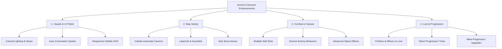

# Archon's Descent - Feature Enhancement & Update Proposals

This document provides a comprehensive review of the current features in **Archon's Descent** and proposes a series of impactful enhancements to elevate the game's visuals, gameplay, progression, and variety.

---

## 1. Current Feature Audit

A deep dive into [index.html](file:///c:/Users/Admin/Dungeon%20Crawler/index.html) reveals a robust single-file classic Roguelike with the following core systems:

*   **Engine & Controls**: Turn-based grid system (60x60) with arrow/WASD movement, mouse pathfinding, and hotkeys.
*   **Procedural Generation**: Standard "Room & Corridor" layout for hostile levels; fixed 9x9 room for Merchant Camps (every 4th depth).
*   **Aesthetic Biomes**: Catacombs (Depths 1-4), Forges (Depths 5-8), and Void (Depths 9+) with custom canvas texture drawing and basic ambient lighting overlays.
*   **Character Archetypes**: Warrior (Defense-oriented with Shield Slam), Mage (Attack-oriented with Fireball), and Rogue (Speed/FOV-oriented with Shadowstep).
*   **Talent System**: A draft selection of 3 random talents upon leveling up (Vampiric Fangs, Thorn Carapace, Titan Vitality, Deep Focus, Brute Force).
*   **Loot & Inventory**: Simple procedural equipment generator (Weapons, Armor, Shields, Accessories) with common, rare, epic, and legendary rarities.
*   **Audio Engine**: Synthesized Web Audio API generating retro sounds for hits, hurts, power-ups, defeat, and victory.

---

## 2. Recommended High-Priority Enhancements

To shift the game from a solid prototype to a premium web application that wows users, we should focus on the following categories:

### 1. Visual Aesthetics & UI Polish
Currently, characters and items are represented by simple flat circles, emojis, and basic canvas shapes.
*   **Enhanced Lighting System**: Upgrade the lighting canvas to support colored lighting. Torches should cast a warm amber glow, lava pools should emit a pulsing red radiance, and void portals should shimmer with deep purple light.
*   **Sprite & Animation Juice**:
    *   Introduce procedural sprite drawing (drawing simple pixel-art structures instead of raw emojis for player/monsters/items) to build a cohesive pixelated look.
    *   Add squish-and-stretch animations when entities strike or take damage.
    *   Implement smooth particle trails for projectile spells (Mage's Fireball sparks, Rogue's shadow particles).
*   **Premium HUD Glassmorphism**: Upgrade the CSS styles of the dashboard panel with frosted glass effects (`backdrop-filter: blur(12px)`), pulsing border glows matching the current biome's theme, and smooth UI entry/exit transitions.

### 2. Map Generation & Environmental Variety
Adding new procedural algorithms will prevent exploration from feeling repetitive.
*   **Organic Caverns (Cellular Automata)**: Generate levels with winding organic caves instead of strict rectangular rooms. Perfect for beast-themed encounters or subterranean forge biomes.
*   **The Labyrinth (Recursive Backtracker)**: Twist the map into narrow 1-tile-wide corridors with poor visibility, high tension, and hidden treasure alcoves.
*   **Epic Boss Arenas**: Fixed-shape layouts (e.g., circular arenas with molten pillars or void rifts) spawning every 10th depth to host custom boss fights with unique mechanics.
*   **Interactable Environment Objects**:
    *   *Explosive Barrels*: Ignite when hit, dealing AOE damage to players and monsters alike.
    *   *Lava Pits / Void Crevices*: Hazards that limit movement, requiring players to pathfind around them or push enemies into them.

### 3. Combat, Class, & AI Depth
Combat should reward tactical play, positioning, and resource management.
*   **Action Bar & Multiple Skills**: Expand the quick belt to support 3 slots for class skills instead of just 1.
    *   *Warrior*: Shield Slam, Whirlwind (AOE sweep), Battle Cry (temporary armor buff).
    *   *Mage*: Fireball, Frostbolt (slows target), Teleport (targeted blink).
    *   *Rogue*: Shadowstep, Poison Blade (DOT apply), Fan of Knives (multi-target physical projectile).
*   **Advanced Status Effects**: Incorporate `Frozen` (reduces speed or freezes target), `Bleed` (damage over time triggered by walking), and `Poison` (ticking damage that bypasses armor).
*   **Intelligent Enemy AI**:
    *   Give enemies patrolling states (moving randomly until the player enters their aggro range or makes noise).
    *   Implement spell telegraphing visuals (e.g., highlighting a red line or circle showing where a powerful spell will hit next turn, giving the player one turn to dodge out of the area).

### 4. Loot & Rogue-Lite Progression Systems
A robust progression loop keeps players engaged for hours.
*   **Procedural Item Affixes & Suffixes**: Instead of a flat `statBonus`, generate items with unique combat modifiers:
    *   *Weapon*: "Fiery Broadsword" (adds burn chance), "Vampiric dagger" (adds lifesteal).
    *   *Armor*: "Plate of Thorns" (reflects damage), "Robe of Focus" (lowers skill cooldowns).
*   **Talent Specializations**: Restructure talent drafts into a structured Talent Tree or more diverse choices, allowing players to build unique combinations (e.g., a "dodge-crit" Rogue vs. a "poison-evasion" Rogue).
*   **Meta-Progression Menu (Soul Shards)**: On death or victory, reward players with a permanent currency (e.g., *Archon Shards*) used to unlock start-of-run upgrades, such as starting with an extra potion, extra gold, or unlocking new character archetypes.

---

## 3. Possible Outcomes & Gameplay Trajectories

Implementing these updates changes the player experience in several ways:

1.  **High-Tension Exploration**: Walking through a dark, organic cavern or a tight labyrinth changes the player's pacing. Emitters, traps, and sight-blocking walls require slow, deliberate steps compared to spacious rooms.
2.  **Deeper Strategic Variety**: With 3 active skills per class and items that apply special effects (like slow or burn), players can strategize combat encounters rather than just bumping into enemies.
3.  **High Visual Polish & Satisfying Feedback**: Adding particles, screen shake, and light glows makes every strike, spellcast, and level-up feel extremely rewarding.
4.  **Excellent Replay Value**: Meta-progression and varied level types give the player a reason to descend again, even after a frustrating death.

---

## 4. Suggested Implementation Phases

If we decide to proceed with implementing these enhancements, here is a recommended roadmap:

### Phase A: Map Diversity & Biome Generation
*   Implement `generateCaverns()` using a cellular automata ruleset.
*   Implement `generateBossArena()` for Depths 10, 20, etc.
*   Integrate these methods into `generateLevel()` based on depth.

### Phase B: Advanced Combat & Class Skills
*   Modify the Player class to store multiple active abilities with unique cooldown trackers.
*   Extend the UI quick-belt and input handlers to support slots 1, 2, and 3 for skills, moving potions to keys 4 and 5.
*   Add projectile animations and particle effects to visual spellcasts.

### Phase C: Loot Modifiers & Tooltips
*   Refactor the procedural item generator to assign prefix/suffix stats (e.g., "+Crit Rate", "+Lifesteal").
*   Improve HUD tooltips to compare bag items with currently equipped gear side-by-side.

### Phase D: Meta-Progression & Polish
*   Create a starting main menu containing Archetype selection and a "Talent Upgrades" shop where players spend currency earned in prior runs.
*   Add biome-themed colored lighting, explosive barrels, and environmental hazards.
