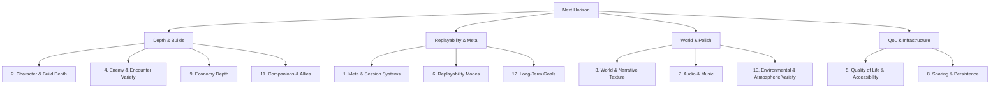

# Archon's Descent — Next Horizon: Ideas & Opportunities

## 0. Why This Doc Exists

The five earlier design docs in this repo (`Design.md`, `feature_enhancement_proposals.md`, `gameplay_expansion_prompt.md`, `game_design_prompt.md`, `animation_prompt.md`, `Map_Generation_Prompt.md`) already did their job — a code audit of `index.html` confirms almost everything they proposed is **live in the game today**:

- 3 classes (Warrior/Mage/Rogue), each with 2 active abilities and cooldowns
- Crit chance, dodge, and 4 status effects (burn w/ spread, poison, chill, stun)
- Floating damage numbers, screen shake, hit-stop, and a level-up shatter animation
- Elite enemies with affixes (vampiric/armored/swift), ranged/summoner/exploder/tank/telegraph enemy types
- 3 unique multi-phase bosses (one per biome) with minion summons
- 3 map generators — room & corridor, cellular-automata caverns, circular boss arenas
- 3 biomes (catacombs/forges/void) with distinct hazards, textures, and lighting
- Merchant Camps with a shop, an Anvil (enchanting + 3-of-a-kind fusion), and buff shrines (Blood/Purify/Haste)
- 4-tier rarity loot with procedural prefixes/suffixes across 4 equipment slots
- A 7-talent draft-on-level-up system
- Meta-progression: "Archon Souls" persisted in `localStorage`, spent in an Archon Hub on permanent upgrades
- Mobile touch D-pad, minimap, tooltips, particles, and Web Audio SFX synthesis

That's a genuinely deep prototype. This doc deliberately does **not** repeat any of the above — it's a fresh brainstorm of what could come *next*, organized into four pillars.

---

## 1. Meta & Session Systems

- **Ascension / mutator tiers**: after the first full clear, unlock a Hades-"Heat"-style system where the player stacks optional modifiers before a run (tougher elites, faster enemy attack speed, fewer shrines) in exchange for bonus Archon Souls and exclusive cosmetic unlocks.
- **Seeded runs**: expose the RNG seed used for a run (display it on the death/victory screen) and let players type in a seed to replay or share an identical dungeon layout.
- **Daily Challenge**: one fixed seed + fixed class + fixed mutator set per calendar day, with a `localStorage`-backed personal-best board (floor reached, time, gold); no backend required.
- **Run history**: a persistent log (`localStorage`) of past runs — class, floors cleared, cause of death, duration — viewable from the main menu.
- **Achievements list**: concrete unlockable milestones (see §12) surfaced in a dedicated panel with progress bars.
- **Unlockable cosmetics**: alternate player sprite palettes, ability-trail colors, or death-screen frames unlocked via Archon Souls or achievements — pure flavor, zero balance impact.

## 2. Character & Build Depth

- **New classes**: Paladin (hybrid tank/healer with a lay-on-hands heal skill), Necromancer (raises a temporary skeleton ally from corpses), Druid/Shapeshifter (swaps between a melee beast form and a ranged caster form mid-run), Ranger (trap-laying + piercing arrows), Alchemist (throws crafted potions as offensive tools).
- **3rd "Archon Skill" slot**: a long-cooldown ultimate unlocked at character level 10, distinct per class (e.g. Warrior: brief invulnerability + AoE slam; Mage: meteor strike; Rogue: chain-teleport execute).
- **Relics/Boons**: passive, run-altering pickups found in the dungeon (not the equipment system) — e.g. "every 4th hit is guaranteed crit," "killing an enemy has a 10% chance to drop a shrine buff," "dodge grants a stacking speed buff." These stack and combo mid-run, giving each run a distinct build identity beyond gear rolls.
- **Curse altars**: optional shrines that apply a voluntary debuff (e.g. -20% max HP) in exchange for a guaranteed legendary drop or a relic reroll — deliberate risk/reward, separate from the existing Blood Shrine.
- **Post-clear Ascension loop**: after a victory, offer a "descend again, but harder" continuation rather than a hard stop, keeping current gear but scaling enemy difficulty — a soft NG+.

## 3. World & Narrative Texture

- **Bestiary/Codex**: unlocked per-enemy-type on first kill, showing lore flavor text, resistances, and attack patterns — gives the "intelligent enemy AI" already in the code a payoff for players who study it.
- **Lore scraps**: short readable scroll/journal pickups scattered in rooms that build out the Archon Descent's backstory (why the dungeon exists, who the bosses were) — cheap to add, big atmosphere payoff.
- **NPC dialogue**: give captive NPCs and the merchant shrine 2-3 line personality barks on rescue/purchase instead of silent interaction.
- **Branching floor choice**: between some depths, present 2-3 route icons (e.g. "Treasure Vault — high risk," "Shrine Path — safe," "Shortcut — skip a floor") the player picks before generating the next level, echoing Slay the Spire's map without needing a full map UI.
- **Evolving Archon Hub**: have the Hub's visual presentation (lighting, decor, banner count) grow as the player sinks more Souls into it, so meta-progression is *seen*, not just read as numbers.

## 4. Enemy & Encounter Variety

- **Mimic chests**: a chest that's actually a stationary/ambush enemy, keyed off the existing chest-spawn logic.
- **Ambush spawns**: enemies that phase in behind the player after they pass a trigger tile, rather than only appearing pre-placed in rooms.
- **Trapper enemies**: a caster type that plants a temporary hazard tile (mirrors the existing spike-trap system) instead of attacking directly.
- **Champion mini-boss rooms**: a single tougher elite (bigger stat multiplier than the current elite affix system) in a small dedicated arena room between the main biome bosses, for mid-run pacing.
- **Horde/survival rooms**: an optional room that locks the doors and spawns waves for N turns; surviving grants bonus loot — reuses the existing enemy-spawn and room systems with a timer wrapper.
- **Vault rooms**: an optional high-density enemy room (visible through a barred door before entry) that guarantees a legendary or relic, for players who want an explicit high-risk detour.

## 5. Quality of Life & Accessibility

- **Settings menu**: SFX volume, screen-shake intensity slider/off-switch, colorblind-safe alternate rarity palette, and rebindable movement/ability keys.
- **Pause menu**: the game currently has no pause state distinct from overlays (talent draft, shop) — add a dedicated Esc-triggered pause with resume/settings/quit-to-menu.
- **Mid-run autosave/resume**: currently only meta-progression (`archonDescent_meta`) survives across sessions; serialize full run state (depth, map, entities, inventory) to `localStorage` so a closed tab doesn't lose an in-progress run.
- **Gamepad support**: map the existing keyboard/touch action set to the Gamepad API for controller play.
- **UI scale/text size option**: a simple CSS-variable-driven scale slider for the HUD, useful on both very large and very small screens.

## 6. Replayability Modes

- **Boss Rush**: unlocked after a first victory — fight all unlocked bosses back-to-back with short breathers, no exploration.
- **Endless/Survival arena**: a single fixed arena (reuse the boss-arena generator) with escalating enemy waves and a scoreboard for how many waves survived.
- **Speedrun timer**: an optional on-screen run clock plus a personal-best table per class, using the run-history log from §1.
- **Challenge mutator cards**: opt-in modifiers offered at the start of a run (e.g. "no potions, +30% loot" or "double enemy speed, +1 relic choice") for players who want to spice up a familiar build.

## 7. Audio & Music

- The game currently has one-shot SFX synthesis only (`SoundEngine`/`sfx` — hits, hurts, power-ups, defeat, victory) and **no music layer**.
- **Procedural adaptive music**: build a lightweight Web-Audio oscillator/LFO-driven ambient loop per biome (catacombs = sparse low drones, forges = rhythmic percussive clangs, void = dissonant shifting pads) that layers in an additional intensity track when combat starts and drops back out a few seconds after the last enemy dies — no external audio files needed, consistent with the existing synth-only approach.
- **Positional/mix polish**: subtle stereo panning on SFX based on entity position relative to the player for a bit of spatial feedback.

## 8. Sharing & Persistence

- **Build card export**: at run end, render a shareable canvas image (class, depth reached, equipped gear, relics, run time) that the player can download as a PNG — a natural finale for the death/victory screen.
- **JSON save export/import**: let players download their `archonDescent_meta` (and eventually mid-run save) as a JSON file and re-import it, so progress isn't locked to one browser profile.
- **Shareable seed codes**: pairs with §1 — a short alphanumeric code that reconstructs a specific run's RNG seed and mutator set for others to attempt.

## 9. Economy Depth

- **Gambling shrine**: spend gold for a random reward roll (ranging from nothing to a legendary), for players who prefer variance over the guaranteed-value shop.
- **Wishing well**: throw gold in for a small chance at a bonus relic or Archon Soul — a pure gold sink for late-run excess currency.
- **Bounty/contract board**: an optional per-floor objective (e.g. "kill the elite without taking damage," "clear this room in under 10 turns") posted near the entrance of a room, paying bonus gold or a guaranteed loot roll.
- **Hand-authored uniques**: a small set of named legendary items with fixed lore text and a signature non-procedural effect (distinct from the existing prefix/suffix roll system), discoverable only from bosses or vault rooms.

## 10. Environmental & Atmospheric Variety

- **Darkness floors**: an occasional depth modifier that shrinks the player's FOV radius, forcing more cautious play — reuses the existing raycasting FOV system with a smaller radius constant.
- **Unstable floors**: hazard tiles (lava/web/spikes) that periodically shift position over time rather than staying static, adding a light puzzle-timing element.
- **Secret rooms**: walls that look cracked/different on the tile texture and can be destroyed (reusing the existing destructible-crate HP logic) to reveal a small bonus loot alcove.

## 11. Companions & Allies

- **Summonable pet**: purchasable at the Merchant Camp or unlocked via the Archon Hub — a small non-combat or light-utility companion (e.g. sniffs out the nearest chest, or periodically grants a tiny heal).
- **Temporary rescued allies**: captive NPCs that, once freed, follow and fight alongside the player for the remainder of that floor (or until they take too much damage) instead of just granting a one-time reward.

## 12. Long-Term Goals

- **Concrete achievements**: e.g. "Defeat the Void Archon Prime without using a potion," "Reach Depth 20," "Fully enchant a legendary weapon," "Complete the bestiary" — tied into the codex/stats systems from §3 and the run-history log from §1.
- **Archon Trials**: fixed-modifier challenge dungeons (short, hand-tuned, non-random) offering cosmetic-only rewards — a venue for testing build mastery without touching the main progression economy.

---

## If You Only Pick Five

For the highest ratio of player-facing impact to implementation effort, in rough priority order:

1. **Relics/Boons (§2)** — the single biggest lever for run-to-run build variety and replay depth.
2. **Settings menu + pause (§5)** — baseline QoL players will immediately notice is missing.
3. **Bestiary/Codex (§3)** — cheap to build off existing enemy data, strong atmosphere payoff.
4. **Daily Challenge + run history (§1)** — turns the game into something players come back to regularly.
5. **Adaptive music layer (§7)** — the single biggest remaining gap in the audio/visual polish that's otherwise very complete.
