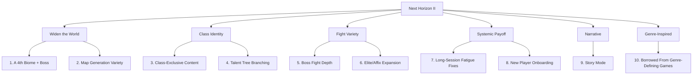

# Archon's Descent — Next Horizon II: Ideas & Opportunities

## 0. Why This Doc Exists

`next_horizon_ideas.md` (the first brainstorm) is now **fully shipped** — see `parked_ideas.md`. That cycle added enormous *depth* inside the game's existing frame: relics, ultimates, curse altars, ascension, companions, autosave, gamepad, mutators, trials, and more. `index.html` is now 6,700+ lines.

But looking at what actually grew versus what didn't is telling. Across that entire buildout:

- **Biomes stayed at 3** (catacombs/forges/void) — every new system (trials, boss rush, endless, mutators) reuses the same three palettes and the same three bosses.
- **Bosses stayed at 3** — one per biome, no new boss silhouette added despite three new classes needing to fight them differently.
- **Map generators stayed at 3** (room & corridor, cellular caverns, circular arena) — no new spatial gimmick.
- **The talent tree stayed flat** — 7 talents drafted on level-up, same list regardless of class or depth.
- **No systemic reason to replay a *specific* class beyond ability flavor** — no class-exclusive rooms, dialogue, or loot.

So where the last doc asked "what depth is missing," this one asks **"what breadth is missing, and where has repetition started to show?"** The prior cycle proved the team can ship fast; the risk now is a very tall game built on a narrow base. Organized into four pillars below.

---

## 1. A 4th Biome + Boss

The single highest-leverage idea in this doc. Every session so far has added *systems*; none has added a *place*. A 4th biome (e.g. a flooded/drowned depths tier, or a crystalline/frozen tier between Forges and Void) would:

- Give Boss Rush/Endless/Ascension a 4th stage instead of recycling the same 3.
- Give the map generator variety (§2) a natural home — a 4th generator (e.g. flooded rooms with currents that push the player) fits a new biome better than being bolted onto an existing one.
- Justify a 4th named unique and a fresh bestiary page, both of which are cheap once the biome exists.

This is a large lift (new tileset/texture palette in `TextureCache`, new hazard type, new boss with a distinct multi-phase pattern, new ambient `MusicEngine` config) but it's the one thing pure system-stacking can't substitute for.

## 2. Map Generation Variety

- **Vertical shafts**: a room type where the player descends/ascends within a single floor via ladders/chasms, breaking the flat top-down traversal pattern for a few rooms.
- **One-way drops**: a chasm tile that commits the player to a lower area with no return path, raising the stakes of exploration choices.
- **Linear gauntlet floors**: an occasional floor with no branching — a straight corridor of escalating fights, playing as a tension floor between the normal maze-like ones.
- **Symmetric mirror rooms**: a rare vault room mirrored left/right, with a switch on one side needed to unlock the other — a light spatial puzzle using existing switch/door logic.

## 3. Class-Exclusive Content

Six classes now exist but share every room, NPC line, and bounty type. Consider:

- **Class-locked doors/shortcuts**: a rare door only a Rogue can pick, or a wall only a Warrior can bash — reusing the existing secret-wall HP logic but gating it by class instead of RNG, giving each class a reason to feel structurally different, not just statistically different.
- **Class-flavored NPC dialogue**: the 4 named NPCs currently give the same barks regardless of who rescues them; branch 1-2 lines per class (a Necromancer player probably gets a different reaction than a Paladin).
- **Class mastery track**: a per-class kill/floor counter (already trackable via run history) that unlocks a small cosmetic or stat nudge at milestones (e.g. 500 Warrior kills unlocks an alternate ability VFX color) — gives replay-the-same-class-again a payoff beyond "try a different build."

## 4. Talent Tree Branching

The 7-talent draft is flat and class-agnostic. A light branching pass:

- **2-3 class-flavored talents** mixed into the shared pool per class (e.g. Necromancer gets a "raised skeletons gain your crit chance" option) — reuses the existing draft-on-level-up UI, just widens the pool conditionally.
- **Talent synergy tags**: mark a couple of existing talents as comboing with specific relics (already itemized in `RELICS`), and surface that synergy as flavor text in the draft tooltip — makes build-crafting feel more intentional without new mechanics.

## 5. Boss Fight Depth

Bosses have been reused as-is across Boss Rush/Ascension/Trials/Endless, just with stat scaling. Consider giving the 3 existing bosses (before/alongside a 4th):

- **An Ascension-tier phase 4**: at Ascension tier 2+, each boss gains one new attack pattern instead of just bigger numbers — makes late Ascension feel qualitatively different, not just a bullet-sponge.
- **Boss-specific arena hazards**: currently the arena is mostly cosmetic; tie one hazard per boss to their attack telegraph (e.g. the Forges boss's slam cracks the floor into temporary lava tiles) so the arena becomes part of the fight.

## 6. Elite/Affix Expansion

- **2-3 new elite affixes** beyond vampiric/armored/swift — e.g. "Volatile" (explodes into hazard tiles on death), "Warded" (periodic short-lived shield), "Frenzied" (attack speed ramps the longer combat continues) — cheap additions that meaningfully change elite fights since affixes already combo.
- **Affix-aware champion rooms**: champions already guarantee 2 affixes; occasionally telegraph the specific affix pair via a room-entry lore toast so players can choose to engage or skip, adding a light risk-assessment layer.

## 7. Long-Session Fatigue Fixes

With this much content, returning players may not remember what's active. Low-effort, high-value QoL:

- **"What's new" changelog ping**: a small badge on the main menu after an update, linking to a 3-bullet changelog — helps a player who hasn't opened the game in weeks re-orient.
- **Loadout presets**: save/load a named talent+relic "build" preference to bias (not force) future drafts toward a playstyle, for players who've found a build they like and don't want to re-discover it every run.
- **Run summary diff**: on the death/victory screen, show a delta against the player's personal best for that class ("+2 floors vs. your best") — small dopamine hook that's pure UI, no new systems.

## 8. New Player Onboarding

The game has grown enormous but likely still opens the same way it always did. Worth checking:

- **A short guided first floor**: contextual tooltips on first-ever encounter with a shrine, chest, elite, and the Anvil — currently these systems are all discoverable-by-accident, which is fine for a returning player but steep for someone brand new given how much now exists.
- **Class recommendation on first launch**: a 2-question flavor quiz ("prefer hitting things or summoning help?") that suggests a starting class, easing the six-option paralysis a first-time player now faces.

## 9. Story Mode

Right now "Archon's Descent" has *ingredients* for a story but no plot connecting them: 14 bestiary lore entries, 12 recoverable lore scraps, 4 named rescued NPCs with one-liners, 5 hand-authored legendary items with lore text, a title that implies a villain (the Archon), and a final boss literally named **Void Archon Prime** — but killing it doesn't resolve anything. There's no framing for *why* the player descends, no acts, no ending. That's a real gap, not a duplicate of anything shipped (the existing lore systems are all flavor-on-discovery, not sequence).

A Story Mode doesn't need a new engine — it needs a **spine that reuses every narrative piece already in the game** and sequences it:

- **A frame narrative, not a new game mode**: Story Mode is normal descent play with one addition — a fixed sequence of story beats gated by depth milestones (e.g. Depth 1, 5, 10, 15, 20, and the Void Archon Prime kill), delivered through the *existing* lore-toast UI (`showLoreToast`, already used for relics/lore scraps). No new screens required.
- **Reframe the 3 biome bosses as Act breaks**: catacombs → forges → void already reads as an escalation. Give each boss kill a short pre-fight toast (who/what they were before the Descent corrupted them) and a post-fight toast (what their death reveals about the Archon) — turns 3 existing fights into Act I/II/III without new content.
- **Retrofit the 4 named NPCs as a plot thread**: Bram, Sera, Old Kettle, and Wisp already exist as rescuable captives with barks. Give them a *reason* to be trapped down there tied to the Archon's backstory, and unlock one additional line from each the first time the player reaches a new Act — turns 4 disconnected flavor NPCs into a supporting cast the player tracks across a run.
- **Lore scraps become chaptered instead of scattered**: the 12 lore scraps currently read in any order. Group them into 3-4 numbered chapters (e.g. "Journal of the First Expedition, page 1 of 4") so collecting them out of order still visibly promises a complete story, borrowing directly from how Hades and Dead Cells make death-and-retry runs feel like they're accumulating a story rather than resetting one (§10 below has more on this).
- **A real ending**: the Void Archon Prime kill currently likely just returns to the Hub like any other boss (worth confirming). A one-time, only-plays-once epilogue screen — a few lines of text plus the existing build-card export — gives the ~20+ hours of systems built so far an actual payoff moment instead of the credits just being "you can keep grinding now."
- **Optional, not mandatory**: this should be a toggle at new-game start ("Story Mode: on/off"), off by default for returning players who just want to grind Ascension/Endless/Trials — story beats are pure toast/dialogue overlays on top of unchanged mechanics, so they cost nothing for players who skip them.

This is scoped deliberately small: **no new mechanics, no new art, no new enemies** — it's a writing and sequencing pass over lore/dialogue systems that already exist, plus one epilogue screen. That makes it a good candidate to pair with §1 (4th biome) later — a new biome would slot in as an Act IV once the spine exists — but it doesn't need to wait for that; it can ship entirely against the current 3-biome game.

## 10. Ideas Borrowed From Genre-Defining Games

Researched directly from what makes each of these games work, then translated into something that fits Archon's Descent's existing systems (turn-based grid movement, relics, talents, `localStorage` meta-progression) rather than copied wholesale.

**From Hades** — narrative keeps deepening across deaths instead of resetting, and boons combo multiplicatively rather than just stacking additively:
- **Death is a story beat, not a reset**: the Hub NPCs already exist (§3); give them 1-2 *new* lines each time the player dies to a boss they haven't beaten yet, referencing the actual cause of death (class, floor, killer) pulled from the run-history log that already exists. Costs no new systems, just conditional dialogue keyed off existing data.
- **Relic-pair synergy tags**: Hades' boons are explicitly designed to combo (e.g. a status-effect boon + a boon that detonates status effects). Audit the existing 12 relics for 3-4 intentional pairs and surface the combo in a toast the *first* time both are active together in one run — makes the existing relic pool feel more designed, not just randomly rolled.

**From Dead Cells** — every weapon must feel distinct, and the game actively discourages attachment to one weapon:
- **Weapon-feel audit on equipment**: check whether the 4 equipment slots' procedural prefixes/suffixes currently change *stats only* or also change attack behavior/animation. If it's stats-only, even 2-3 "behavior-changing" affixes (e.g. a weapon suffix that turns your basic attack into a cleave, or adds a bounce) would make gear swaps feel like Dead Cells rather than a spreadsheet update.
- **Soft anti-hoarding nudge**: Dead Cells' devs deliberately engineer moments that push players off their favorite weapon. A rare shrine or event that offers a strong temporary weapon swap (with a bonus for using it) would test whether players over-commit to one loadout.

**From Slay the Spire** — map nodes are risk-priced before you commit, and shops are the "zero-risk" release valve:
- **Pre-reveal node risk icons on the branching floor-choice screen** (§3 in the first doc, already shipped): Slay the Spire shows elite/rest/shop/unknown *before* the player commits. The existing 3-option branch (Treasure Vault/Shrine Path/Shortcut) could add a 4th "Elite Gauntlet" option with a visibly higher risk icon and better guaranteed reward, giving the choice screen actual risk-grading instead of 3 roughly-equal options.
- **A genuine zero-risk shop node**: confirm the Merchant Camp can be reached without a fight on the floor it spawns; if not, an explicit "safe shop floor" occasionally offered on the branch screen (mirroring Spire's shop node) gives players a real breather option, not just a cheaper-risk one.

**From classic roguelikes (Brogue/NetHack)** — unidentified items create tension through *not* knowing, resolved by use or risk:
- **Unidentified relic option**: currently relics likely show their effect on pickup. A rare "cursed-looking" relic variant that's hidden until triggered once (good or bad) reintroduces the identify-by-use tension these genre originators are known for, without needing a full identification economy.

**From Risk of Rain 2 / Vampire Survivors** — item stacking that scales into visibly absurd late-run power, read at a glance:
- **A visual "power state" tell**: RoR2's late-game read is instant — your character is visibly covered in item auras. At high relic/talent counts (e.g. 6+ active relics), add a cheap cumulative visual tell (aura color layering, particle density) so a screenshot of a late-run character silently communicates "this is a loaded build" the way build-card exports (already shipped) do in text form.

---

*This doc deliberately avoids re-proposing anything from `next_horizon_ideas.md` (fully shipped, see `parked_ideas.md`). Unlike that cycle, several items here (§1 in particular) are structural rather than additive — they change the shape of the game rather than adding another system on top of the existing shape. §9 (Story Mode) and §10 items are individually small (mostly writing/sequencing over existing systems, or a UI tell on existing data) and could be batched together cheaply. Recommend scoping §1 (4th biome) as its own dedicated session given its size; §3/§4/§6/§7/§9/§10 are each small enough to batch together if the user wants another "build several at once" pass.*
